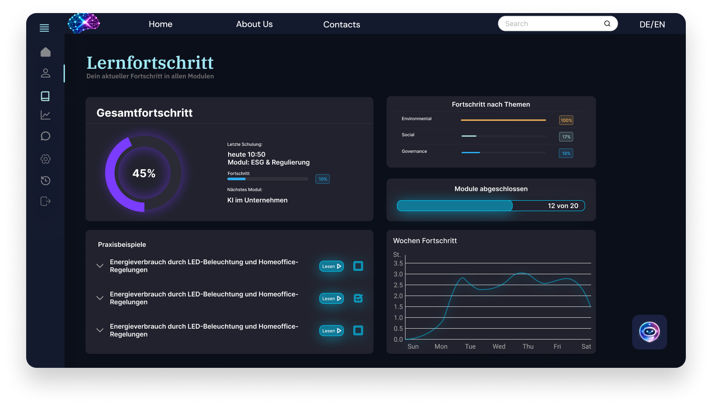

# ESG-Schulung Website – UI Design (Figma)

Beschreibung: 
Uni-Teamprojekt zur Gestaltung einer ESG-Schulungswebsite. Meine Aufgabe war das Design der Anmeldeseite sowie zweier Inhaltsseiten in Figma. 

Tools:
- Figma
- UI Design
- Prototyping
- Wireframing

Screens: 

Link zum Prototyp: 
https://www.figma.com/design/zJPC7fT6dP2A2RiegVZtb0/Untitled?node-id=0-1&t=VXIEOrlgYfZwFnHB-1
